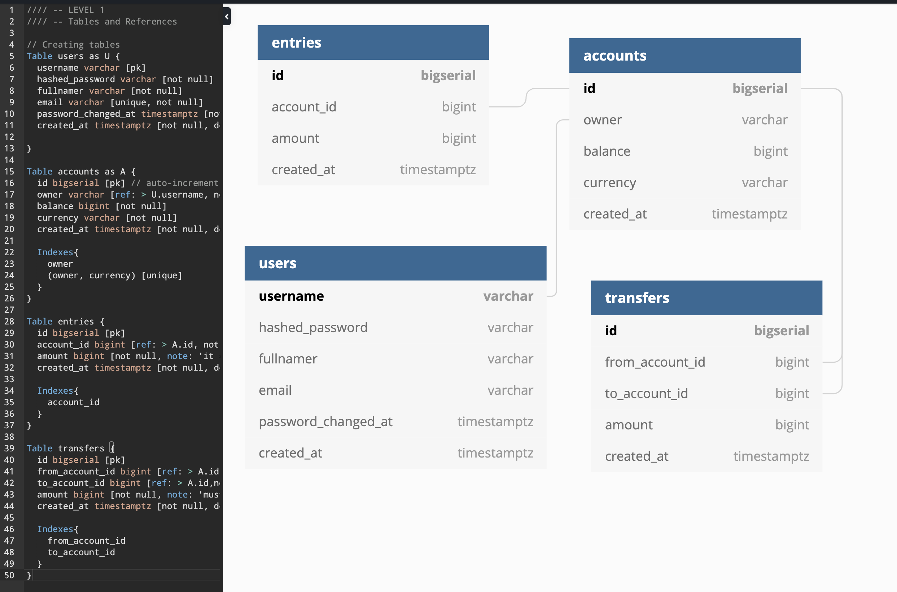

## Simple bank application

<br />

### Purposes:

- Provide API for frontend to do those things:

  1. Create and manage bank account (Owner, balance, currency)
  2. Record all balance change (Create entry account for each change)
  3. Money transfer transaction (Perform money tranfer between 2 accounts consistency within a transaction - Solving Double Booking problem)

- Demo tech stacks used in application:

  1. Golang for main langage
  2. GIN for rest API
  3. Authentication and authorization using JWT / Paseto
  4. Unit testing with testify / gomock / default go test
  5. SQLC for high performance SQL query with auto generate type-safe interfaces to those queries
  6. Postgres DB
  7. GoMock for store mocking using in APT testing
  8. Docker and Docker compose for local development
  9. CI/CD with Github action

### DB Schema: (dbdiagram.io)

<br />



<br />

### Usages:

1. Start app and db containers:

```
docker compose up
```

2. Test API

```
make test
```

3. Stop and remove containers:

```
docker compose down
```

#### Notes:

<br />

This app follow **Backend Master** class that creatd by TechSchool channel (https://www.youtube.com/channel/UC6MtKoJrZLNELkS96F99eIQ)
